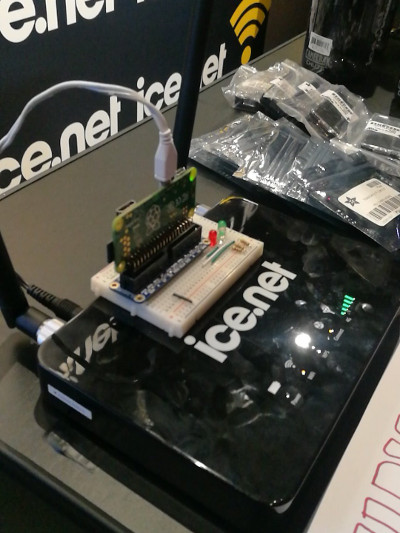
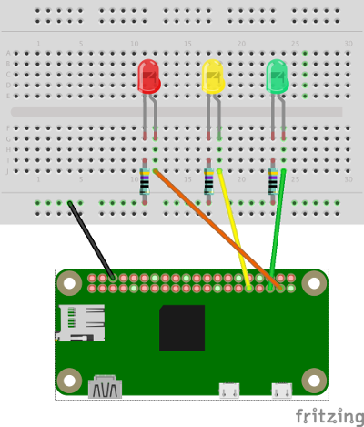

# NDC Competition

## Used by Ice during NDC Oslo 2017

Built using Elixir and Phoenix. Deployed using Nerves.

The competition was hosted on a Raspberry Pi Zero W with 3 LEDs.
The goal was to get all three LEDs to light up.



## Steps for winning
1. Figure out SSID and password to get on the same network as the RPi. Provided by hints on the spot.
2. Find the IP of the RPi. Do a local scan or brute force search. The RPi responds to ping.
3. Find the port of the webserver. Portscan or provided by hints
4. Find the API at /api
5. Follow the instructions on the API. Three questions needs to be answered. Each question lights up an LED.
6. After all three questions are correctly answered, you get a 4 character code to verify you are a winner.

## Hardware setup
The hardware setup is a connection of 3 LEDs with resistors to protect the LEDs. The Fritzing file can be found [here](competition.fzz).



## Up and running
If you have never used [Elixir](https://elixir-lang.org), [Phoenix](http://www.phoenixframework.org) and [Nerves](http://nerves-project.org) before, you need to install these on you computer first. In addition the setup uses [Slack](https://slack.com) to notify the hosts on what is going on (including notifying winners), and [timber.io](https://timer.io) to log system events and exceptions.

### Elixir
Elixir is the main language of this setup.
Head over to [https://elixir-lang.org](https://elixir-lang.org) and follow instructions there to install Elixir.

### Phoenix
Phoenix framework is the webserver. Follow instructions at [http://www.phoenixframework.org](http://www.phoenixframework.org) to install.

### Nerves
Nerves is used to bundle everything in a nice image to the SD card of the RPi. It wraps together the OS, runtime and your code in a package, and helps you burn the image to the SD card. Go to [http://nerves-project.org](http://nerves-project.org) to install.

### Slack
The setup needs a Slack webhook to post notifications to. Follow the instructions on Slack to create a webhook. Use the URL in the config (described below).

### Timber.io
The setup uses timber.io for logging. Head over to [timber.io](https://timber.io), sign up and get an API key. Use the API key in the config file (described below).

### Config
To avoid getting secret leaking to github (or any other source controls), you need to create the following file: `/apps/firmware/config/prod.secret.exs` and fill in the blanks from the template below.

```
use Mix.Config

config :firmware, :wlan0,
  ssid: "<WLAN SSID>",
  psk: "<WLAN password>"

config :timber,
  api_key: "<API key from timber.io>"

config :api, Api.Endpoint,
  secret_key_base: "<random secure key - can reuse the one in confix.exs>"

config :api, :questions,
  q1: "What is 1+1",
  a1: 2,
  q2: "What is 2+2?",
  a2: 5,
  q3: "What is the Answer to the Ultimate Question of Life, The Universe, and Everything?",
  a3: 42

config :api, :slack,
  url: "<url to slack webhook>"
```

### Instructions
With all the above in place, you can follow these steps to get up and running (instructions verified on MacOS, might differ on Windows):
1. Go to the folder `/apps/firmware`
2. Set target (hardware type): `export MIX_TARGET=rpi0`
3. Set environment: `export MIX_ENV=prod`
2. Download dependecies: `mix deps.get`
3. Compile: `mix compile`
4. Generate firmware image: `mix firmware`
5. Plug in SD card to your computer
6. Burn image to SD card: `mix firmware.burn`
7. Plug the SD card into the RPi
8. Power up the RPi
